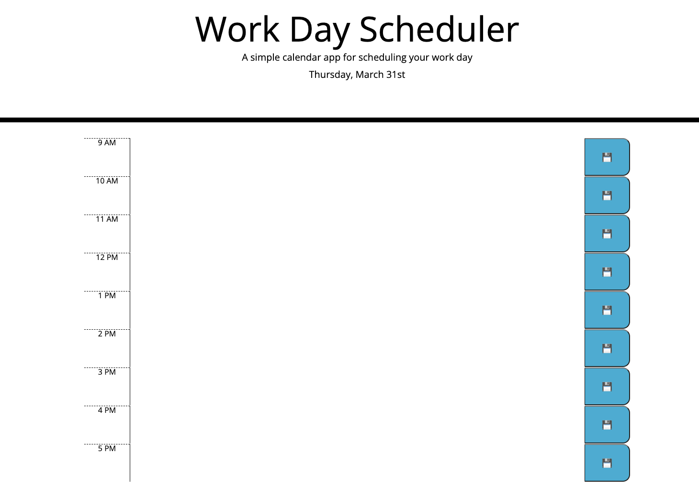
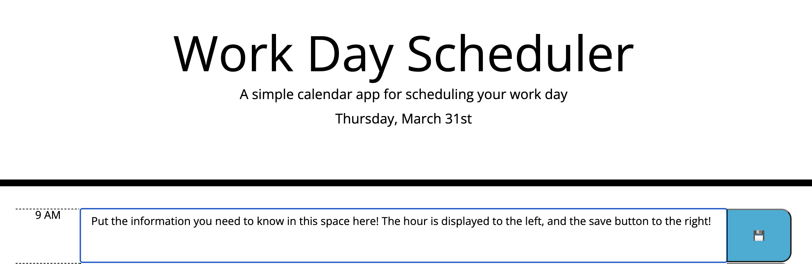

Development on hold:

# Daily Calendar

## About this app

This application was designed to allow user to track their daily tasks via time sheet. The sheet displays from 9AM to 5PM and will color code dependent on what time it currently is. The current day of the week, time in hours and minutes, and date are displayed at the top of the page underneath the title. 

## Screencap

## Functionality
User may enter text into the center column at the appropriate hour of which they need to do their task by left clicking in the space provided and then selecting the save button. 

The save button is the furthest right column of the three. Pressing the save button will store the users data so that the user may come back to see what tasks they have remaining in the day. 

## Contributions

Contributions are not currently accepted as production of application is on hiatus. Production and contributions to application may continue at a later date. 

## live link to current production state

